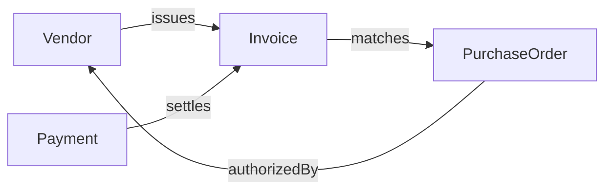
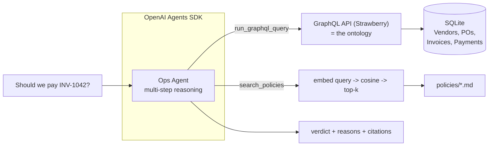

# Varick Ops Agent

An AI agent for **accounts-payable reconciliation**: given an invoice, it decides whether to **pay** or **hold** it, citing the data and policy behind every call.

It queries a business **ontology over GraphQL** for structured facts, grounds its judgment in company **policy via RAG**, returns a structured recommendation, and its quality is measured with an **eval suite** (decision accuracy + groundedness).


---

## The problem

A company gets **invoices** (bills) from **vendors** (suppliers) all day. Someone in finance has to decide for each one: *do we pay this, or is something off?* Paying a bad invoice means money walks out the door, so before paying, finance does **reconciliation** — checking that the bill matches what was actually agreed to and delivered.

Today a person opens several systems, cross-checks numbers, looks up the relevant policy, and makes a call. This agent automates that.

### The four entities

Think of it as a paper trail of four document types:

- **Vendor** — a supplier you buy from (e.g. "Acme Office Supplies"). Has a `status` like `active` or `under_review` (flagged for a possible problem or fraud).
- **Purchase Order (PO)** — *your* document, created **before** delivery, recording what you agreed to buy (e.g. "$9,000 of freight services from Globex"). The promise.
- **Invoice** — the *vendor's* bill, arriving **after**, asking to be paid. This is what we evaluate.
- **Payment** — the record of money already sent. Used to detect "did we already pay this?"

### How they relate (the ontology)

An ontology is a formal model of a domain: the entities that exist, their attributes, and the relationships between them. The GraphQL schema *is* the ontology.




The core idea: **an invoice should match its purchase order.** The PO is what you agreed to; the invoice is what you're billed. If they don't line up, something is wrong.

### What reconciliation checks

1. **Amount match** — does the invoice equal its PO? Agreed $9,000 but billed $12,400? Red flag.
2. **Vendor standing** — is the vendor `active`? You don't pay a vendor that's `under_review`.
3. **Duplicate payment** — is there already a `Payment` that settled this invoice? Vendors sometimes double-bill.
4. **Policy threshold** — company rule: invoices over $10,000 require VP sign-off, not auto-approval.

Checks 1–3 are **structured facts** → resolved via the GraphQL ontology. Check 4 is a **written policy** → resolved via RAG (the actual threshold is retrieved from the doc, not hardcoded). The agent combines both.

### What the agent decides

For each invoice it returns one of:

- **APPROVE** — every check passes, under threshold, vendor fine → safe to pay automatically.
- **HOLD** — something is off → don't pay; escalate to a human with reasons and citations.

The "why + citation" on every decision is the **audit trail** — finance is legally required to document why money was or wasn't sent.

### The two demo scenarios

- **INV-1007 (clean):** vendor `active`, $4,200 matching its PO $4,200, no prior payment, under $10k.
→ **APPROVE.** *"Matches PO exactly, vendor active, $4,200 is below the $10k auto-approval threshold (approval-thresholds.md)."*
- **INV-1042 (exception):** vendor `under_review`, $12,400 vs PO $9,000.
→ **HOLD.** *"Exceeds PO by $3,400; vendor flagged under_review; amount exceeds $10k VP-approval threshold. Route to VP. Sources: fraud-controls.md, approval-thresholds.md."*

---

## Architecture




The agent runs a tool-calling loop: it queries the ontology for facts, retrieves the governing policies, and synthesizes a structured decision. Both tools feed one auditable output.

### Tech stack (and why)

- **Python + OpenAI Agents SDK** — the SDK's `Runner` drives the tool-calling loop, so the focus stays on the ontology and tools rather than orchestration plumbing.
- **Strawberry GraphQL + FastAPI** — Python-native GraphQL with a built-in **GraphiQL** playground for live querying during a demo. The agent writes raw GraphQL queries, directly proving GraphQL fluency.
- **SQLite** — zero-setup store for the ontology. The *relationships* (Invoice → PO → Vendor) are what make it an ontology, not the engine.
- **OpenAI embeddings + NumPy cosine search** — with only a handful of policy docs, a full vector database is overkill. Production path: pgvector/Qdrant with reranking + hybrid search.
- **Structured output (`output_type`)** — the agent returns `{hold_conditions_triggered, verdict, reasons, citations}` as a Pydantic model so both the demo and evals read fields directly instead of parsing prose.

---

## Evals

An eval is a test suite for a non-deterministic system. You can't string-match LLM output, so you score *properties* over a small labeled set of cases — using two complementary methods:

- **Programmatic assertions** (deterministic): assert `verdict == expected` and that required policy sources appear in `citations`. Catches wrong decisions and missing grounding.
- **LLM-as-judge** (for fuzzy quality): a second model call scores **groundedness** 1–5 — are the claims supported by the retrieved policy text, or invented? Catches the qualities assertions can't express.

`evals/cases.json` holds ~5 labeled scenarios. `evals/run_evals.py` loops the cases through the agent and prints a scorecard: verdict accuracy + avg groundedness.

This also drives a clean structural decision: the agent returns **structured output** (a Pydantic model via `output_type`) instead of free text, so both the demo and the evals can read fields directly rather than parsing prose.

---

## Project structure

```
varick-ops-agent/
  README.md
  requirements.txt
  .env.example            # OPENAI_API_KEY=, OPS_MODEL=
  db.py                   # shared SQLite connection
  data/
    seed.py               # builds ops.db with mock vendors/POs/invoices/payments
  policies/               # unstructured docs for RAG
    approval-thresholds.md
    payment-terms.md
    fraud-controls.md
    vendor-onboarding.md
  graphql_app/
    schema.py             # Strawberry types (the ontology) + Query resolvers
    server.py             # FastAPI + GraphiQL at /graphql + REST API endpoints
  rag/
    embeddings.py         # shared embedding helper (model must match between indexer + retriever)
    index.py              # embed policy chunks -> save vectors to policy_index.json
    retriever.py          # embed query, cosine top-k, return text + source
  agent/
    tools.py              # @function_tool run_graphql_query() + search_policies()
    ops_agent.py          # Agent definition + Recommendation output_type
  evals/
    cases.json            # labeled scenarios: invoice_id, expected_verdict, must_cite[]
    run_evals.py          # scorecard: verdict accuracy + LLM-judge groundedness
  web/                    # React + Vite + Tailwind web interface
    src/
      pages/
        About.jsx         # project explainer (ontology, GraphQL, RAG, evals, architecture)
        Demo.jsx          # interactive demo: pick invoice, run agent, see trace + verdict
  demo.py                 # CLI: python demo.py INV-1042  -> prints trace + recommendation
```

---

## Usage

> Requires **Python 3.12+** and an `**OPENAI_API_KEY`**. Demo cost is a few cents.

```bash
# 1. environment
python3.12 -m venv .venv && source .venv/bin/activate
pip install -r requirements.txt
cp .env.example .env             # add your OPENAI_API_KEY

# 2. build the data layer (one-time)
python -m data.seed              # create ops.db with vendors/POs/invoices/payments
python -m rag.index              # embed policy docs -> policy_index.json

# 3a. web interface 
uvicorn graphql_app.server:app --port 8000   # terminal 1: backend API + GraphiQL
cd web && npm run dev                         # terminal 2: React frontend at localhost:5173

# 3b. CLI (quick check)
python demo.py INV-1007          # -> APPROVE
python demo.py INV-1042          # -> HOLD

# 4. run evals
python -m evals.run_evals        # -> verdict accuracy + avg groundedness scorecard
```

Scripts inside packages run with `python -m` so imports resolve correctly from the project root.

---


