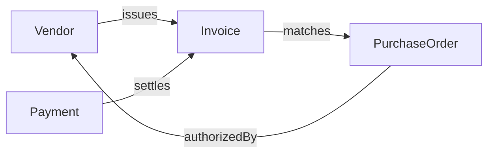
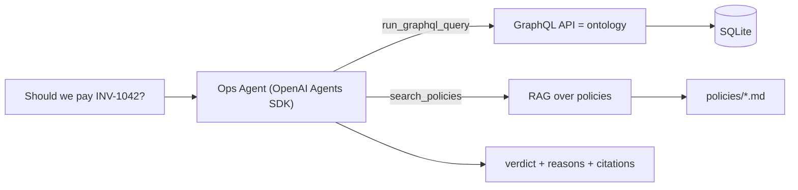

# Varick Ops Agent

An AI agent for **accounts-payable reconciliation**: given an invoice, it decides whether to **pay** or **hold** it — citing the data and policy behind every call.

It queries a business **ontology over GraphQL** for facts, grounds its judgment in company **policy via RAG**, returns a structured recommendation, and its quality is measured with an **eval suite**.

## The problem

A company gets **invoices** (bills) from **vendors** (suppliers). Before paying, finance reconciles each one against what was agreed and delivered. This agent automates that check.

Four entities, related as an ontology:




- **Vendor** — a supplier; `status` is `active` or `under_review`.
- **Purchase Order (PO)** — what you agreed to buy, created *before* delivery.
- **Invoice** — the vendor's bill, arriving *after*. The thing we evaluate.
- **Payment** — money already sent (used to catch double-billing).

An invoice should match its PO. The agent checks: (1) invoice amount == PO amount, (2) vendor is `active`, (3) not already paid, (4) amounts over $10k need VP approval. Checks 1–3 come from GraphQL; check 4 comes from a policy doc via RAG. It then returns **APPROVE** or **HOLD** with reasons + citations (the audit trail).

Two demo cases:

- **INV-1007** — $4,200, matches PO, vendor active → **APPROVE**.
- **INV-1042** — $12,400 vs $9,000 PO, vendor `under_review` → **HOLD, route to VP** (`fraud-controls.md`, `approval-thresholds.md`).

## Architecture




- **OpenAI Agents SDK** drives the tool-calling loop.
- **Strawberry GraphQL + FastAPI** exposes the ontology (GraphiQL playground for live queries).
- **SQLite** stores the entities; **OpenAI embeddings + NumPy cosine** power RAG over the policy docs.
- Agent returns **structured output** (`{verdict, reasons, citations}`) so the demo and evals read fields directly.

## Evals

You can't string-match LLM output, so we score *properties* over labeled cases:

- **Assertions** — `verdict == expected` and required sources appear in `citations`.
- **LLM-as-judge** — scores **groundedness** 1–5: are the claims supported by retrieved policy, or invented?

`evals/run_evals.py` prints a scorecard (accuracy + avg groundedness).

## Usage

> Requires Python 3.12+ and an `OPENAI_API_KEY`.

```bash
python3.12 -m venv .venv && source .venv/bin/activate
pip install -r requirements.txt
cp .env.example .env             # add your key

python -m data.seed              # build the SQLite ontology
python -m rag.index              # embed the policy docs
uvicorn graphql_app.server:app   # GraphQL + GraphiQL at /graphql (optional, for live querying)

python demo.py INV-1007          # -> APPROVE
python demo.py INV-1042          # -> HOLD
python -m evals.run_evals        # -> scorecard
```

Scripts inside packages run with `python -m` so imports resolve from the project root.

